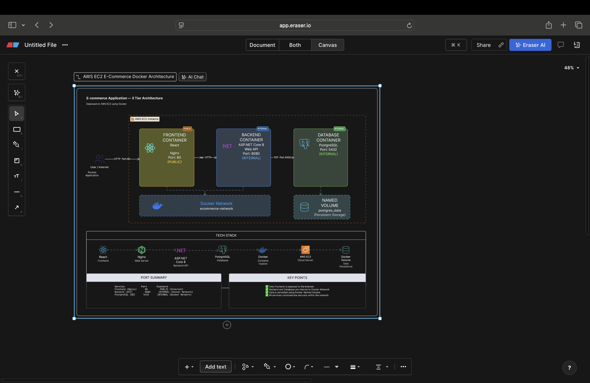

# 🛒 Full-Stack E-Commerce DevOps Deployment


A production-style DevOps implementation of an existing three-tier e-commerce application.

The application consists of:

- React + TypeScript frontend
- ASP.NET Core 8 backend
- PostgreSQL database

The main goal of this project was to take an existing application and apply practical DevOps concepts including Docker, multi-stage builds, Docker Compose, container networking, persistent storage, Nginx reverse proxying, health checks, runtime configuration, Git practices, and AWS EC2 deployment.

---

## 📌 Project Objective

The objective was not to develop a new application from scratch.

Instead, an existing open-source three-tier application was used as the base application and the following DevOps work was implemented:

- Run and validate the application locally
- Understand the application architecture
- Create a three-tier system-design diagram
- Containerize frontend and backend separately
- Use multi-stage Docker builds
- Optimize Docker build layers
- Add `.dockerignore` files
- Run the backend container as a non-root user
- Containerize PostgreSQL
- Configure persistent database storage
- Create a custom Docker network
- Use Docker service-name DNS instead of hardcoded IP addresses
- Configure Nginx as a reverse proxy
- Keep backend and database ports internal
- Add container health checks
- Track and automatically apply EF Core migrations
- Manage services using Docker Compose
- Prove database persistence after container recreation
- Deploy the complete stack on AWS EC2
- Validate the application through the EC2 public endpoint

---

# 🏗️ Architecture



The deployed architecture follows a three-tier model:

```text
                         Internet / Browser
                                |
                                | HTTP :80
                                v
                    +-----------------------+
                    |     AWS EC2 Ubuntu    |
                    |                       |
                    |  +-----------------+  |
                    |  |    Frontend     |  |
                    |  | React + Nginx   |  |
                    |  |    Port 80      |  |
                    |  +--------+--------+  |
                    |           |           |
                    |           | /api      |
                    |           v           |
                    |  +-----------------+  |
                    |  |     Backend     |  |
                    |  | ASP.NET Core 8  |  |
                    |  | Internal :8080  |  |
                    |  +--------+--------+  |
                    |           |           |
                    |     EF Core/Npgsql    |
                    |           |           |
                    |           v           |
                    |  +-----------------+  |
                    |  |   PostgreSQL    |  |
                    |  | Internal :5432  |  |
                    |  +--------+--------+  |
                    |           |           |
                    |           v           |
                    |    postgres_data      |
                    |    Named Volume       |
                    +-----------------------+
```

Only the frontend is exposed publicly.

The backend and PostgreSQL database communicate internally through Docker networking.

---

# 🧰 Technology Stack

## Frontend

- React 18
- TypeScript
- Vite
- Redux Toolkit
- Material UI
- Tailwind CSS
- Axios
- Nginx

## Backend

- C#
- ASP.NET Core 8
- Entity Framework Core 8
- REST APIs
- JWT Authentication
- Npgsql

## Database

- PostgreSQL 14

## DevOps / Infrastructure

- Git
- GitHub
- Docker
- Docker Compose
- Multi-stage Docker builds
- Docker custom networks
- Docker named volumes
- Container health checks
- Nginx reverse proxy
- Environment variables
- AWS EC2
- Ubuntu Linux

---

# 📁 Repository Structure

```text
fullstack-ecommerce-app/
│
├── backend/
│   ├── Ecommerce.Domain/
│   ├── Ecommerce.Infrastructure/
│   ├── Ecommerce.Presentation/
│   ├── Ecommerce.Service/
│   ├── Ecommerce.Tests/
│   ├── Dockerfile
│   └── .dockerignore
│
├── frontend/
│   ├── src/
│   ├── public/
│   ├── Dockerfile
│   ├── .dockerignore
│   └── nginx.conf
│
├── documentation/
│   └── devops/
│       └── system-design.png
│
├── docker-compose.yml
├── .gitignore
├── README.md
└── LICENSE
```

---

# 🐳 Backend Dockerization

The ASP.NET Core backend uses a multi-stage Docker build.

## Build Stage

The first stage uses the .NET 8 SDK image.

It is responsible for:

- copying project files
- restoring NuGet dependencies
- copying application source code
- publishing the application in Release mode

The project files are copied before the full source code so Docker can cache the dependency restore layer.

Conceptually:

```text
Copy .csproj files
        |
        v
dotnet restore
        |
        v
Copy source code
        |
        v
dotnet publish
```

This improves rebuild performance when source code changes but dependencies remain unchanged.

## Runtime Stage

The final backend image uses the ASP.NET Core runtime rather than the full SDK.

Benefits:

- smaller final image
- compiler not included in production
- reduced attack surface
- fewer unnecessary build tools

The backend also runs using a non-root user.

This was verified with:

```bash
docker run --rm --entrypoint id ecommerce-backend:local
```

The container returned a non-root `app` user.

---

# ⚛️ Frontend Dockerization

The frontend also uses a multi-stage Docker build.

## Build Stage

Node.js is used to:

```text
Install dependencies
        |
        v
Compile TypeScript
        |
        v
Build React/Vite application
        |
        v
dist/
```

## Runtime Stage

The generated `dist` files are copied into an Nginx Alpine image.

The final frontend image therefore does not require:

- Node.js runtime
- npm
- TypeScript compiler
- application source code

Nginx serves only the generated production assets.

---

# 🌐 Nginx Reverse Proxy

Nginx performs two responsibilities:

1. Serves the React production application
2. Proxies `/api` traffic to the backend container

Request flow:

```text
Browser
   |
   | /api/v1/products
   v
Nginx
   |
   | backend:8080
   v
ASP.NET Core API
```

This design means the backend does not need to be publicly exposed.

The frontend can use a relative API path:

```text
/api/v1
```

instead of a hardcoded public backend IP address.

---

# 🐳 Docker Compose

The complete application is orchestrated using Docker Compose.

The Compose stack contains three services:

```text
frontend
backend
db
```

Start the full stack:

```bash
docker compose up -d --build
```

Check service status:

```bash
docker compose ps
```

Stop the stack:

```bash
docker compose down
```

---

# 🔗 Docker Networking

A custom Docker bridge network is used:

```text
ecommerce-network
```

All containers communicate using Docker service names.

Frontend communicates with:

```text
backend:8080
```

Backend communicates with:

```text
db:5432
```

No hardcoded container IP addresses are required.

Docker's internal DNS resolves the service names automatically.

---

# 🔐 Public vs Internal Ports

| Service | Container Port | Host Exposure |
|---|---:|---|
| Frontend / Nginx | 80 | Public |
| ASP.NET Core Backend | 8080 | Internal only |
| PostgreSQL | 5432 | Internal only |

The database does not publish port `5432` to the EC2 host.

The backend does not publish port `8080` to the EC2 host.

Only Nginx port `80` is publicly exposed.

---

# 💾 PostgreSQL Persistence

PostgreSQL data is stored using a Docker named volume.

```text
postgres_data
```

The volume is mounted to PostgreSQL's data directory.

This separates the database lifecycle from the container lifecycle.

## Persistence Test

Persistence was verified using the following process:

```text
Create test record
       |
       v
Verify record exists
       |
       v
docker compose down
       |
       v
Containers removed
       |
       v
docker compose up -d
       |
       v
Containers recreated
       |
       v
Query same record
       |
       v
Record still exists
```

`docker compose down` was intentionally used without `-v`.

Using:

```bash
docker compose down -v
```

would remove the named volume and therefore delete the persistent database data.

---

# 🗄️ Entity Framework Core Migrations

EF Core migration files are tracked in Git so a fresh environment can reproduce the database schema.

Pending migrations are applied when the backend starts.

```csharp
using (var scope = app.Services.CreateScope())
{
    var dbContext =
        scope.ServiceProvider.GetRequiredService<ApplicationDbContext>();

    dbContext.Database.Migrate();
}
```

This allows a new PostgreSQL container on another machine or EC2 instance to automatically receive the required schema.

---

# ❤️ Health Checks

Health checks are configured for important services.

## PostgreSQL

PostgreSQL health is checked using:

```text
pg_isready
```

## Backend

The backend health check verifies that the ASP.NET application is responding.

Docker Compose waits for PostgreSQL to become healthy before starting the backend.

This creates a more reliable startup sequence:

```text
PostgreSQL starts
       |
       v
PostgreSQL becomes healthy
       |
       v
Backend starts
       |
       v
EF migrations applied
       |
       v
Backend becomes healthy
       |
       v
Frontend starts
```

---

# 🔑 Runtime Configuration and Secrets

Sensitive configuration is not baked into Docker images.

The following values are injected at runtime:

- PostgreSQL database name
- PostgreSQL username
- PostgreSQL password
- JWT issuer
- JWT signing key

Example `.env` structure:

```env
POSTGRES_DB=ecommerce_db
POSTGRES_USER=ecommerce_user
POSTGRES_PASSWORD=your_database_password

JWT_ISSUER=EcommerceAPI
JWT_KEY=your_jwt_signing_key
```

The real `.env` file is excluded from Git.

Secrets such as:

- `.env`
- `.pem` private keys
- passwords
- JWT keys
- authentication tokens

must never be committed to the repository.

---

# 🖥️ Local Deployment

## 1. Clone Repository

```bash
git clone https://github.com/Anne-hub-coder/fullstack-ecommerce-app.git
```

Enter the project:

```bash
cd fullstack-ecommerce-app
```

## 2. Create Environment File

Create:

```text
.env
```

Example:

```env
POSTGRES_DB=ecommerce_db
POSTGRES_USER=ecommerce_user
POSTGRES_PASSWORD=change_me

JWT_ISSUER=EcommerceAPI
JWT_KEY=change_me
```

## 3. Build and Start

```bash
docker compose up -d --build
```

## 4. Verify

```bash
docker compose ps
```

Expected services:

```text
ecommerce-db
ecommerce-backend
ecommerce-frontend
```

## 5. Access Application

Open:

```text
http://localhost
```

---

# ☁️ AWS EC2 Deployment

The complete Docker Compose application was deployed to AWS EC2.

## EC2 Environment

- Ubuntu Linux
- Docker Engine
- Docker Compose
- Git
- Public HTTP access through port 80

Deployment flow:

```text
Local Development
       |
       v
Git / GitHub
       |
       v
AWS EC2 Ubuntu
       |
       v
Clone Repository
       |
       v
Create .env
       |
       v
docker compose up -d --build
       |
       v
Frontend + Backend + PostgreSQL
```

The containers were built directly on EC2 so Docker produced images for the EC2 host architecture.

---

# 🛡️ AWS Security Group

The EC2 Security Group was configured so that only required ports were exposed.

Public inbound access:

```text
SSH   TCP 22
HTTP  TCP 80
```

Application ports that remain private:

```text
8080
5432
```

This means users access the application through Nginx while backend and database services remain internal.

---

# ✅ Deployment Validation

The running stack was validated with:

```bash
docker compose ps
```

The result confirmed:

```text
PostgreSQL   healthy
Backend      healthy
Frontend     running
```

The API was tested through the Nginx public entry point:

```bash
curl "http://localhost/api/v1/products?limit=5"
```

Product data was successfully returned from PostgreSQL.

This validates the complete request flow:

```text
HTTP request
     |
     v
Nginx
     |
     v
ASP.NET Core API
     |
     v
Entity Framework Core
     |
     v
PostgreSQL
```

The frontend was also successfully accessed from a browser using the EC2 public IPv4 address.

---

# 📦 Docker Image Optimization

Both application images use multi-stage builds.

## Backend

```text
.NET SDK
   |
   v
dotnet publish
   |
   v
ASP.NET Runtime
```

## Frontend

```text
Node.js
   |
   v
Vite Production Build
   |
   v
Nginx
```

This keeps build tools out of the final runtime images.

Docker layer ordering was also designed so dependency installation can be cached.

---

# 🌿 Git Workflow

DevOps implementation was developed on a dedicated branch:

```text
devops-implementation
```

Changes were committed incrementally instead of using one large final commit.

Examples from the project history:

```text
docs: add three-tier system architecture diagram

chore: ignore macOS metadata files

docker: add multi-stage backend container

fix: prepare frontend for production build

docker: add React frontend with Nginx

db: track and apply EF Core migrations

docker: orchestrate three-tier stack with Compose

merge: complete DevOps implementation
```

This provides a clear development and troubleshooting history.

---

# 🧯 Troubleshooting and Key Learnings

Real issues encountered during the project were documented and resolved.

## 1. Shell PATH Configuration Issue

The Mac shell initially had an invalid PATH configuration.

Commands such as:

```text
curl
uname
```

could not be located normally.

The issue was traced to an incorrectly configured `.zshrc` and fixed by restoring the PATH.

### Learning

Always verify the environment before assuming an application or tool is broken.

---

## 2. .NET Solution Build Failure

The complete solution initially failed because the existing test project was out of sync with the current service constructor.

The deployable backend projects were isolated and tested separately.

### Learning

A solution-level failure does not necessarily mean the production application itself cannot build.

Identify the exact failing project before troubleshooting.

---

## 3. EF Core Configuration Failure

EF Core initially failed while attempting to create the `DbContext`.

The underlying problem was invalid JSON configuration rather than Entity Framework itself.

The JSON configuration was independently validated and corrected.

### Learning

Fix the earliest/root error rather than troubleshooting only the downstream exception.

---

## 4. PostgreSQL Role Error

Database migration initially failed because:

```text
role ecommerce_user does not exist
```

A dedicated PostgreSQL role was created and configured.

### Learning

Application connectivity depends on both database availability and valid database identity/permissions.

---

## 5. Frontend Dependency Conflict

Frontend dependency installation initially returned an npm peer-dependency resolution error.

The existing project had incompatible peer-dependency expectations.

The baseline installation was completed using:

```bash
npm install --legacy-peer-deps
```

### Learning

Avoid blindly using `--force` when dependency resolution fails.

Understand whether the problem is a version mismatch before modifying packages.

---

## 6. Frontend Production TypeScript Build Failure

The application worked in Vite development mode but initially failed during:

```bash
npm run build
```

TypeScript detected source-code issues that development mode had not blocked.

The issues were corrected before the production Docker image was built.

### Learning

A working development server does not guarantee that the application can produce a clean production build.

---

## 7. Docker Daemon Not Running

Docker CLI was installed successfully, but Docker commands failed because Docker Desktop was not running.

Example symptom:

```text
failed to connect to the docker API
```

Starting Docker Desktop restored daemon connectivity.

### Learning

Docker CLI and Docker daemon are separate components.

Having the `docker` command installed does not guarantee the Docker engine is available.

---

## 8. localhost vs host.docker.internal vs Docker DNS

During local application development:

```text
localhost
```

referred to services running directly on the Mac.

During standalone backend-container testing, PostgreSQL was still running on the Mac, so the backend used:

```text
host.docker.internal
```

After PostgreSQL was containerized with Docker Compose, the backend used:

```text
db
```

Final Compose connection:

```text
Host=db
```

### Learning

Inside a container:

```text
localhost
```

means the container itself.

Docker Compose service names should be used for container-to-container communication.

---

## 9. Docker Compose Network Driver Typo

Compose initially failed with:

```text
plugin "bridge°" not found
```

An accidental special character had been added to the Docker network driver.

It was corrected from:

```text
bridge°
```

to:

```text
bridge
```

### Learning

When container images build successfully but Compose fails during network creation, isolate the issue to networking configuration instead of rebuilding the images.

---

## 10. EC2 SSH Connectivity

SSH initially timed out because the EC2 Security Group source IP did not match the current public IP of the development machine.

The rule was corrected and connectivity restored.

### Learning

Security Groups are stateful network controls and source-IP restrictions must match the actual client public IP.

---

## 11. EC2 Package Installation Delay

Ubuntu package installation temporarily waited for repository headers.

The package update was retried using IPv4.

### Learning

Cloud troubleshooting may involve networking and operating-system package repositories in addition to the application itself.

---

# 🎯 Project Result

The final solution successfully demonstrates:

- Existing three-tier application analysis
- React frontend containerization
- ASP.NET Core backend containerization
- PostgreSQL containerization
- Separate frontend and backend Dockerfiles
- Multi-stage Docker builds
- Minimal production runtime images
- Docker layer caching
- `.dockerignore`
- Non-root backend execution
- Nginx production server
- Nginx reverse proxy
- Docker Compose orchestration
- Custom Docker bridge network
- Docker service-name DNS
- Internal backend communication
- Internal PostgreSQL communication
- Named PostgreSQL volume
- Database persistence validation
- EF Core migrations
- Automatic migration execution
- PostgreSQL health check
- Backend health check
- Runtime configuration
- Secret separation using `.env`
- AWS EC2 deployment
- Public HTTP access
- Security Group configuration
- End-to-end API validation

---

# 🚀 Future Improvements

Possible future improvements include:

- GitHub Actions CI/CD pipeline
- Automated Docker image builds
- Amazon ECR
- HTTPS/TLS
- AWS Application Load Balancer
- Amazon RDS for PostgreSQL
- Infrastructure as Code using Terraform
- Prometheus monitoring
- Grafana dashboards
- Centralized application logging
- Container vulnerability scanning
- Automated backup strategy
- Domain name and DNS configuration

---

# 🙏 Original Application Credit

The application used as the starting point for this project was the open-source:

```text
MohamadNach/fullstack-ecommerce-app
```

The original repository provided the React, ASP.NET Core, and PostgreSQL application.

The following work was implemented as part of this DevOps project:

- Dockerfiles
- Multi-stage container builds
- Docker Compose
- Docker networking
- PostgreSQL persistence
- Nginx reverse proxy
- runtime environment configuration
- health checks
- EF Core migration handling
- AWS EC2 deployment
- DevOps architecture
- deployment testing
- troubleshooting documentation

